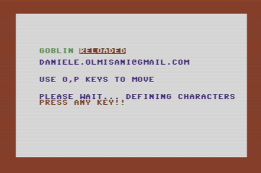
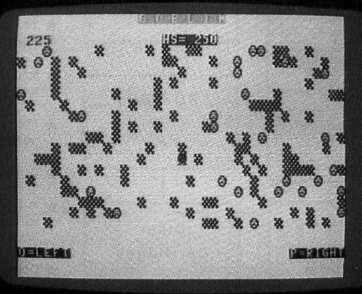

Goblin RELOADED
===============

C64 remake of Compute! Goblin (by Dan Goff) using:

* Emulator: [Vice](http://vice-emu.sourceforge.net/)
* IDE: [CBM prg Studio](http://www.ajordison.co.uk/)

Original source from [Compute! Magazine](http://www.atarimagazines.com/compute/issue38/023_1_GOBLIN.php)

### Reduced startup time
Only digit chars are copied from ROM map (80 instead of 2048 bytes)

### Improved code readabilty
* Code identation
* Subroutines
* List Zones

### Goals
- [ ] more readable code
  - [ ] comment usage
  - [ ] constant name
  - [ ] loop indentation
- [ ] better performances
  - [ ] better startup time
- [ ] enhanched graphics
  - [ ] add colors to gamefield
  - [ ] add graphic titles
  - [ ] modified goblin sprite
- [ ] improved game experience
  - [ ] allow more side steps 
  - [ ] penalities
